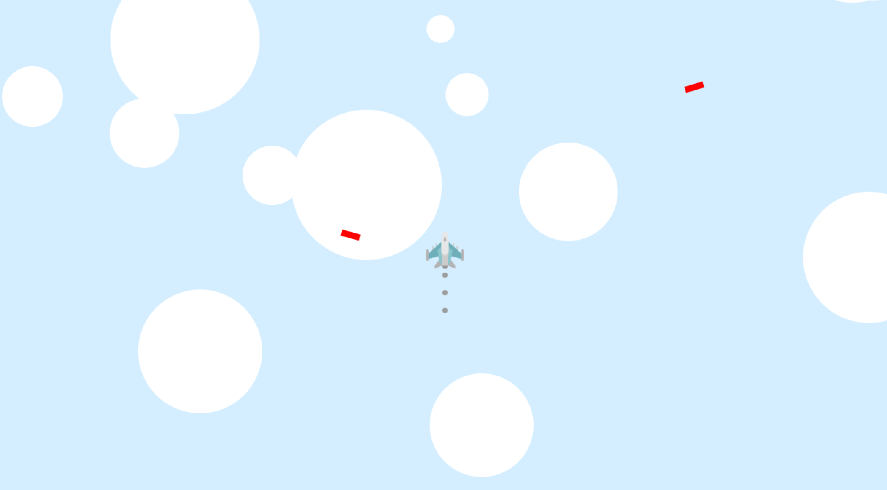

# 미사일 피하기 게임

## 개발 계획

- [x] 바탕화면 띄우기
- [x] Player & Cloud 생성
- [x] Clouds 움직이기 구현
- [x] player의 움직임에 따른 Clouds 움직임 구현
- [x] 전투기(Player) 배기(emission) 구현
- [x] Add Sprite - 전투기 (Player)
- [x] 미사일 클래서 생성

## 개발 과정 (2023-10-13)


- player의 각도에 따른 구름들의 세밀한 움직임 구현
- 아래는 핵심 코드

```js
let direction = new Vector(
  -Math.sin(player.rotation),
  Math.cos(player.rotation)
);
```

## 개발 과정 (2023-10-15)



- 미사일 생성
- 미사일의 방향 - velocity 에 따른 각도 설정

```js
ctx.rotate(-Math.atan2(this.velocity.x, this.velocity.y));
```

- Math.atan2의 부정값!
